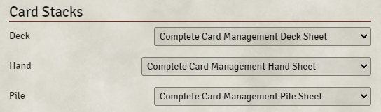
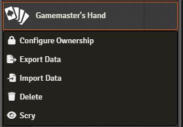
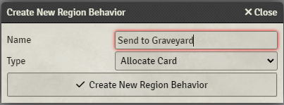
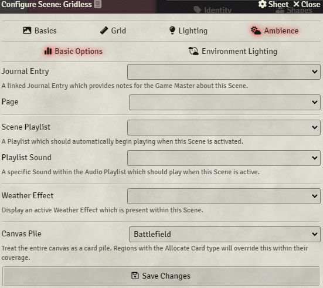

# Complete Card Management

A FVTT module that allows users to manipulate cards as part of the canvas.

[Official package page](https://foundryvtt.com/packages/complete-card-management)

## Installation

Simply search "Complete Card Management" in the **Install Module** dialog on the setup screen.

### Manual Installation

You can also install the module by pasting the following URL into the **Install Module** dialog on the Setup menu of your Foundry application.

https://github.com/MetaMorphic-Digital/complete-card-management/releases/latest/download/module.json

You can also download specific versions by visiting the [Releases](https://github.com/MetaMorphic-Digital/complete-card-management/releases) page for the repository and copying the appropriate `module.json` URL and pasting it into the install module dialog.

## Complete Card Management Sheets

The Complete Card Management module comes with new sheets for the various card stacks. You can access them by going to core settings and opening the "Configure Default Sheets" menu. Alternatively, you can open any card stack and click the "Sheets" button in the header to adjust the selected sheet for that specific card stack and/or card stack type.

## Module Functionality

CCM has many other features available to users

### Scrying

CCM includes "Scrying" functionality, which lets you peek at the cards in the deck. If you're looking at the top or bottom of the deck, you can rearrange the cards in the dialog to reorder them; you can also send cards to the other end of the deck or to other piles. You can begin scrying by right-clicking on a card in the sidebar to open the context menu and then select "Scry"!

### Locked Deck Drag

Locking a card on the canvas changes the drag behavior from moving its position to pulling the top card out of it. If the deck is flipped, it will pull the bottom card.

### Allocate Card Region Behavior

CCM also comes with a new Region behavior, "Allocate Card", which will send any cards moved into the region to the linked pile. This integrates fully with normal region controls such as setting a region to be always visible to all players, allowing you to create an interactive playmat.

Related, you can set an entire scene to effectively act as a card region by going to the Ambience tab of the scene configuration and setting the Canvas Pile. Any cards that are dropped on a part of the scene *without* a region will be moved to the set pile.

### More on the wiki

You can read more details about the module's functionality, including key things to know for developers, on the [module wiki](https://github.com/MetaMorphic-Digital/complete-card-management/wiki)